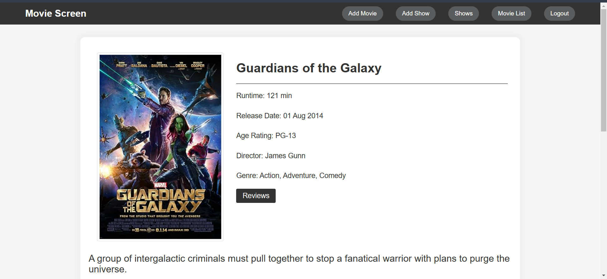
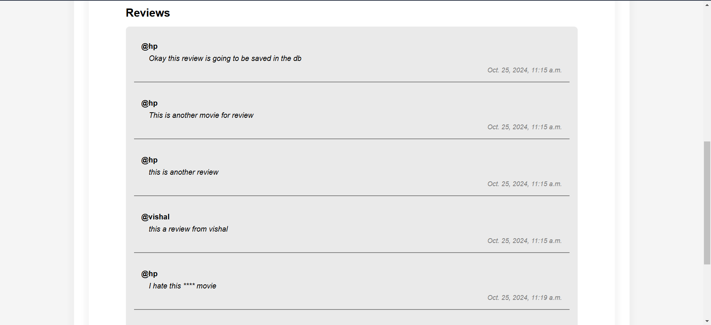

# MovieScreen

A basic Django website for first-time learners.


## Documentation

For detailed documentation, visit: [Django Documentation](https://docs.djangoproject.com/en/5.0/)

## Prerequisites

- Install Python. To see which version is compatible, visit: [Django FAQ](https://docs.djangoproject.com/en/5.0/faq/install/#what-python-version-can-i-use-with-django)

## Setting Up a Virtual Environment

### On Linux

1. Create a virtual environment:
    ```bash
    python3 -m venv myvenv
    ```

2. Activate the virtual environment:
    ```bash
    source myvenv/bin/activate
    ```

3. Install the required packages:
    ```bash
    pip install -r requirements.txt
    ```

4. Deactivate the virtual environment when done:
    ```bash
    deactivate
    ```

### On Windows

1. Create a virtual environment:
    ```bash
    python -m venv myvenv
    ```

2. Activate the virtual environment:
    ```bash
    myvenv\Scripts\activate
    ```

3. Install the required packages:
    ```bash
    pip install -r requirements.txt
    ```

4. Deactivate the virtual environment when done:
    ```bash
    deactivate
    ```
## Running Migrations
Once Django is installed, you need to create the database tables for the application:

Make migrations for your user app:

```bash
   python manage.py makemigrations user
```
Apply the migrations to the database:

```bash
   python manage.py migrate
```
## Installing Django

Before coding, you need to install Django in your virtual environment:
```bash
pip install django
```


##    Connecting to the OMDB API
To fetch movie data from OMDB, you need to create an API key. Follow these steps:
1. Go to the OMDB API website: https://www.omdbapi.com
2. Click on the API Key tab.
3. Scroll down to the Pricing section and select the Free or Paid plan depending on your usage.
4. Sign up for an account using your email.
5. Verify your email and log in.
6. Navigate to the API Key section in your profile.
7. Copy your generated API key.

## Connecting to the TMBD API
To fetch cast names and images of a movie from TMDB, you need to create an API key. Follow these steps:
1. Go to the OMDB API website: https://www.themoviedb.org/settings/api
2. You should be logged in the access this page. If not then signup or login.
3. In the 'Request API key' section click on the given link.
4. Choose the 'Developer' option
5. Accept the license aggrement.
6. Fill the required details in the form.
7. Copy your genearted 'API Key'(not the API read access token).

###    Adding the TMDB API Key to Your Project
1. Create a .env file in the root directory of your project, if created already then skip to step 2:
```bash
touch .env
```
2. Add your TMDB API key to the .env file as:
```bash
 TMDB_API_KEY=<your_api_key>
```

## Contributing 
While raing the pull request, add ypur name to the CONTRIBUTORS.md file

## Updating requirements.txt
While adding packages, update requirements.
```bash
pip freeze > requirements.txt
```
## Email config
1. Let most of the email setting as they are.
2. For EMAIL_HOST_USER & DEFAULT_FROM_EMAIL set the mail account you want to send mail from
3. Go to the google manage account for the email you set
    - Enable 2 step verification
    - Generate a HOST_PASSWORD from app password in the gmail account
4. set EMAIL_HOST_PASSWORD to the app password you generated

[Setup Tutorial Refference](https://www.geeksforgeeks.org/setup-sending-email-in-django-project/)

### Note: 
Make sure of the spellcheck.\
Might not work with proxy so try using you cellular network


# Movie Screen Features
---
 ### Content Table
- [Signup/Login](#signup-login)
- [Show Listing](#show-listing)
- [Show Ticket Booking](#show-ticket-booking)
- [Adding New Show](#add-new-show)
- [Movie Listing](#movie-listing)
- [Adding New Movie](#add-new-movie)
- [Movie Details](#movie-details)
- [Movie Reviews](#movie-reviews)


## <u>SignUp Login</u>
User signup and login along with custom toast notification\
to deal wiht different fallback cases 

<br>
<br>
<br>

## <u>Show Listing</u>
List of all available shows along with movie meta data such as\
Movie title, Show timing, Poster and option to book show ticket

<br>

## <u>Show Ticket Booking</u>
Display page list of all available show seats indicated via\
different colors for availability. 
Option to confirm ticket booking or go\
back to shows page 


<br>
<br>

## <u>Add New Show</u>
Form page to add new show from available movies, show timeing\
&
unique UUID


<br>


## <u>Movie Listing</u>

List of all available movies along with movie meta data such as\
Movie title, discription, Poster, imdb & Critic rating via omdbapi and\
option to add add personal ratings

<br>


## <u>Add new movie</u>

Form page to fetch and add movie information using the\
omdbapi along with realtime suggestion

<br>

<br>

## <u>Movie details</u>

Page with detail discription about the movie.List of meta data about\
movie including the cast info & the option to add review

<br>

<br>

## <u>Movie Reviews</u>

Page related to movies facilitating the user to add their movie\
experience only after they have attended the movie session.\
Also list of reviews from all users with mild Censorship against\
swear words 


<br>

<br>


